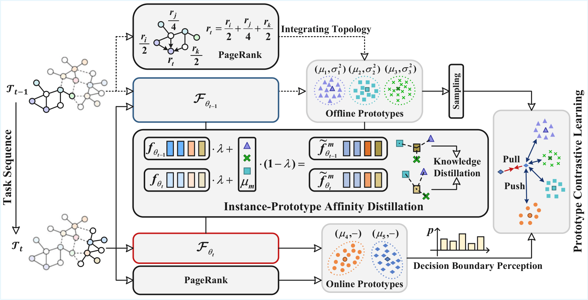

# Instance-Prototype Affinity Learning for Non-Exemplar Continual Graph Learning (IPAL)

This repository contains the official implementation of the paper: **Instance-Prototype Affinity Learning for Non-Exemplar Continual Graph Learning**.

<p align="center">
  
</p>

## 🔥 Overview

Graph Neural Networks (GNN) endure catastrophic forgetting, undermining their capacity to preserve previously acquired knowledge amid the assimilation of novel information. Rehearsal-based techniques revisit historical examples, adopted as a principal strategy to alleviate this phenomenon. However, memory explosion and privacy infringements impose significant constraints on their utility. Non-Exemplar methods circumvent the prior issues through Prototype Replay (PR), yet feature drift presents new challenges. In this paper, our empirical findings reveal that Prototype Contrastive Learning (PCL) exhibits less pronounced drift than conventional PR. Drawing upon PCL, we propose **I**nstance-**P**rototype **A**ffinity **L**earning (**IPAL**), a novel paradigm for Non-Exemplar Continual Graph Learning (NECGL). Exploiting graph structural information, we formulate Topology-Integrated Gaussian Prototypes (TIGP), guiding feature distributions towards high-impact nodes to augment the model's capacity for assimilating new knowledge. Instance-Prototype Affinity Distillation (IPAD) safeguards task memory by regularizing discontinuities in class relationships. Moreover, we embed a Decision Boundary Perception (DBP) mechanism within PCL, fostering greater inter-class discriminability. Evaluations on four node classification benchmark datasets demonstrate that our method outperforms existing state-of-the-art methods, achieving a better trade-off between plasticity and stability.

## 📁 Datasets

We use benchmark node classification datasets including:

CS-CL

CoraFull-CL

Arxiv-CL

Reddit-CL

## 🚀 Training

To train IPAL on a small-scale dataset (e.g., CS-CL, CoraFull-CL) in a full-graph setting:

```bash
python train.py --ILmode classIL --inter-task-edges False --minibatch False --dataset <DATASET> --method ncil
```

To train IPAL on a large-scale dataset (e.g., Arxiv-CL, Reddit-CL) in a mini-batch setting:

```bash
python train.py --ILmode classIL --inter-task-edges False --minibatch True --dataset <DATASET> --method ncil 
```

## 🌟 Acknowledgement

This work is implemented based on [CGLB](https://github.com/QueuQ/CGLB). We sincerely thank the authors for their valuable contributions.
